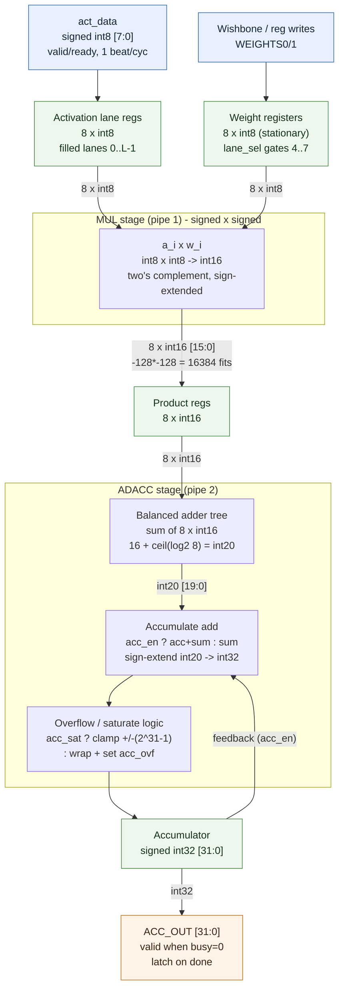
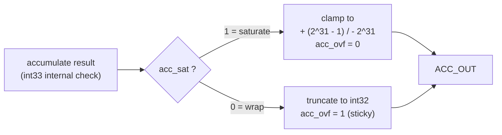
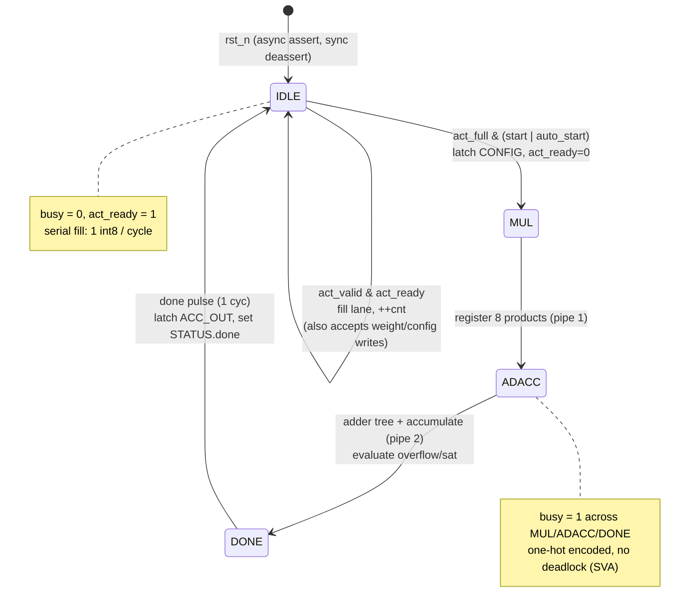
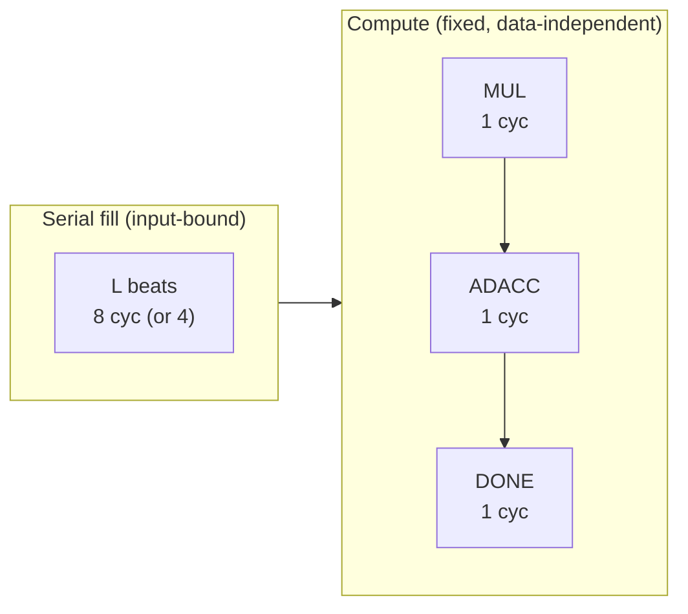
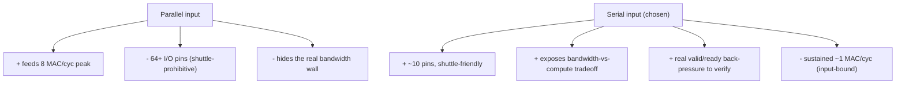
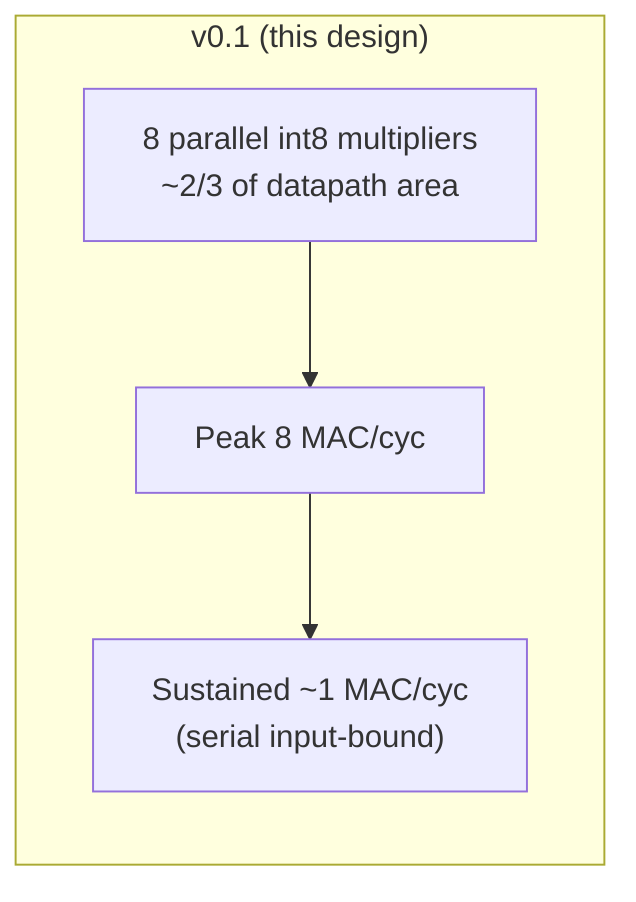

# MACC‑8 — Block Diagram & Micro‑architecture Notes

Companion to `int8_mac_design_spec.md`. All bit widths, signedness, overflow, latency, and the serial‑input / area‑throughput rationale are captured below.

---

## 1. Datapath block diagram (bit widths + signed arithmetic)

**Signed arithmetic behavior.** Every operand is two's‑complement. `int8 × int8` is a signed multiply producing an exact `int16` (`[-128,127]² ⊂ int16`; the worst case `-128 × -128 = 16384` fits with room to spare). The adder tree sign‑extends each `int16` product and grows to `int20` so a full 8‑lane sum can never overflow *within a pass* (`8 × ±2^15 < 2^19`). Before accumulation the `int20` sum is sign‑extended to `int32`. `CONFIG.act_signed` / `wt_signed` allow unsigned interpretation per operand if needed, but the datapath default is signed×signed.

**Overflow / saturation behavior.** Overflow is possible *only* at the `int32` accumulator, across many accumulating passes — never inside a single pass. `CONFIG.acc_sat` selects the policy:

The accumulate adder is evaluated one bit wider (int33) purely to detect the signed carry‑out; the stored result is always int32.

---

## 2. FSM state diagram (+ latency per operation)

**Latency per operation** (cycles at `clk`, weights already resident):

| Operation | Cycles |
|---|---|
| `start` → `done` (vector resident) | **3** (MUL → ADACC → DONE) |
| One full chunk incl. serial fill | `L + 3` → **11** (8‑lane) / **7** (4‑lane) |
| Length‑`K` dot product, `M=K/L` chunks, fills overlapping compute | `≈ M·L + 3` (fill‑bound) |

Compute latency is constant and independent of operand values — scheduling‑friendly. End‑to‑end is dominated by the `L`‑cycle serial fill, which is the crux of the next two sections.

---

## 3. Why serial input instead of parallel

A parallel port would present all `L` int8 activations (and/or all weights) in one cycle. I chose **byte‑serial** deliberately:

- **Pin/area budget on the shuttle.** A parallel 8‑lane activation port is `8 × 8 = 64` bits of I/O plus handshake; on Caravel/TinyTapeout, top‑level GPIO is the scarcest resource. Byte‑serial needs `8 + valid/ready ≈ 10` pins. For a portfolio tapeout, pins are the binding constraint, not gates.
- **Matches real accelerator front ends.** Production engines are almost never limited by compute — they're limited by how fast operands arrive from memory/NoC. A serial front end makes that bandwidth wall *explicit and measurable* in a small design, which is the more honest and more interesting engineering story.
- **Clean handshake demonstration.** A `valid`/`ready` streaming port exercises real back‑pressure, stall, and protocol‑assertion verification — skills that generalize far beyond this block.
- **Weight‑stationary amortization.** Because weights are register‑mapped and reused, only activations stream. Serial cost is paid once per activation vector, not per MAC, so the architecture is coherent rather than gratuitously slow.

The cost — capped sustained throughput — is not hidden; it is quantified below and set up as the v0.2 rebalancing target.

---

## 4. Area vs. throughput tradeoff

The core tension: the **8‑lane array is provisioned for 8 MAC/cycle, but the byte‑serial front end sustains only ~1 int8/cycle → ~1 MAC/cycle.** Roughly 8× of the multiplier area does no useful work in steady state.

| Design point | Multipliers | Peak MAC/cyc | Sustained MAC/cyc | Area | Utilization |
|---|---|---|---|---|---|
| 8‑lane parallel (v0.1) | 8 | 8 | ~1 | high | ~12% |
| 4‑lane (`lane_sel=0`) | 4 (active) | 4 | ~1 | med | ~25% |
| **1 time‑shared multiplier (v0.2)** | 1 | 1 | ~1 | **low** | **~100%** |
| Wider input + 8 lanes (v0.2) | 8 | 8 | ~8 | high | ~100% |

**Reading the table.** Given a 1‑byte/cycle input, spending area on 8 multipliers buys peak numbers you can't sustain. Two principled fixes:

1. **Shrink the array to match the input** — fold the 8 lanes onto 1 (or 2) time‑multiplexed multiplier(s). Sustained throughput is unchanged (~1 MAC/cyc), utilization approaches 100%, and multiplier area drops ~8×. Best *area‑efficiency* point for this input bandwidth.
2. **Widen the input to match the array** — a parallel/multi‑byte port or bit‑parallel weight+activation load lifts sustained toward 8 MAC/cyc, finally justifying the 8 multipliers. Best *throughput* point, at the pin/area cost from §3.

The 8‑lane parallel v0.1 is intentionally the *worst* point on this curve for sustained work — it exists to make the tradeoff concrete and to keep peak MAC/adder‑tree logic visible for the RTL/verification story. The design is parameterized (`LANES`, and a planned `MUL_SHARE` factor) so all four rows above are the same source with different knobs — which is itself the portfolio point: PPA is a dial, not a rewrite.
